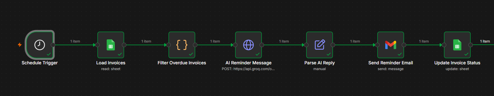

# Invoice Payment Reminder Automation

An n8n workflow that automatically finds overdue invoices, writes an AI-generated payment reminder email in the right tone, sends it, and keeps the tracking sheet up to date — no manual follow-up needed.

## What it does

1. **Runs on a schedule** — checks every day at 9:00 AM automatically.
2. **Loads all invoices** from a Google Sheet.
3. **Filters for overdue, unpaid invoices** and calculates how many days overdue each one is.
4. **Picks the right tone with AI**:
   - 1–3 days overdue → friendly reminder
   - 4–14 days overdue → firm follow-up
   - 15+ days overdue → final notice (still professional)
5. **Generates a custom reminder email** for each client using an AI model (Groq), including the invoice number, amount, and days overdue.
6. **Sends the email automatically** via Gmail.
7. **Updates the Google Sheet** with the date of the last reminder and how many reminders have been sent for that invoice.

## Tech Stack

- **n8n** — workflow automation / orchestration
- **Google Sheets API** — invoice data storage and tracking
- **Groq API (LLM)** — AI-generated reminder email text, tone-adjusted per invoice
- **Gmail API** — automated email sending

## Why this matters

Manually tracking which invoices are overdue and writing follow-up emails is repetitive and easy to forget. This workflow removes that manual step entirely — invoices are checked daily, and clients get a professionally-worded reminder automatically, with the tone escalating the longer a payment is overdue.

## Setup

1. Import `invoice_payment_reminder_workflow.json` into your n8n instance.
2. Connect your **Google Sheets** account (OAuth2) and point it to a sheet named `Invoices` with columns: `invoice_id`, `client_name`, `client_email`, `amount`, `due_date`, `status`, `reminder_count`.
3. Add your **Groq API key** under the AI Reminder Message node.
4. Connect your **Gmail** account (OAuth2) for sending reminder emails.
5. Activate the workflow — it will run automatically every day at 9 AM.

## Author

Built by **Azka Nadeem** — AI Automation Specialist
[LinkedIn](https://linkedin.com/in/azka-nadeem-70169b394)
